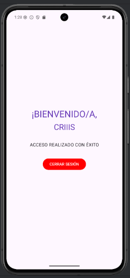

# 📱 Login App con Jetpack Compose

Este repositorio contiene una aplicación de Android simple desarrollada como parte de una prueba práctica para la asignatura de Programación Multimedia y Dispositivos Móviles.

## Descripción de la Actividad

La actividad consistió en implementar la funcionalidad básica de una pantalla de **inicio de sesión (Login)** y una pantalla de **bienvenida** usando Jetpack Compose.

La aplicación tiene dos pantallas principales:
1.  **Pantalla de Login:** Permite al usuario introducir un nombre de usuario/email y una contraseña mediante componentes `OutlinedTextField`. Al pulsar el botón "Login", la aplicación navega a la siguiente pantalla sin realizar una validación real de las credenciales.
2.  **Pantalla de Bienvenida:** Muestra un mensaje de bienvenida personalizado, utilizando el dato de usuario/email capturado en la pantalla anterior.

Se utilizó **Navigation Compose** para gestionar el flujo entre las dos pantallas (`login` y `bienvenido`) y para el paso de datos.

## Capturas de Pantalla

Aquí puedes ver la interfaz de la aplicación desarrollada:

### Pantalla de Login

### Pantalla de Bienvenida

## Tecnologías Utilizadas

* **Android Studio:** Entorno de desarrollo integrado (IDE).
* **Kotlin:** Lenguaje de programación principal.
* **Jetpack Compose:** Framework para la construcción declarativa de la interfaz de usuario (UI) en Android, incluyendo el uso de componentes como `Text`, `TextField`, `Button`, `Column`, etc., y la gestión de estados (`remember`, `mutableStateOf`, `rememberSaveable`).
* **Navigation Compose:** Para la navegación entre las diferentes rutas (`login` y `bienvenido`).
